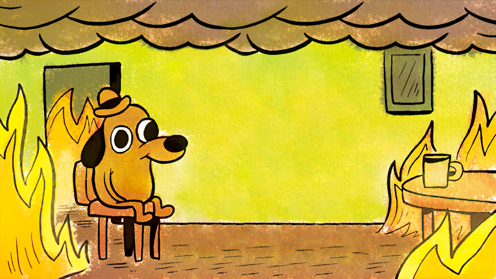

  

  <ul>
    
<h1> Hi 👋, I'm Arsenii Misiurenko </h1>

  </ul>

 

 - 🔭 I’m currently in highschool
 - 🌱 Major in CS and Cyber security
 - 💬 Open to communication
 - 📫 Looking for project ideas or work opportunities

 

## ⚡ Skills

